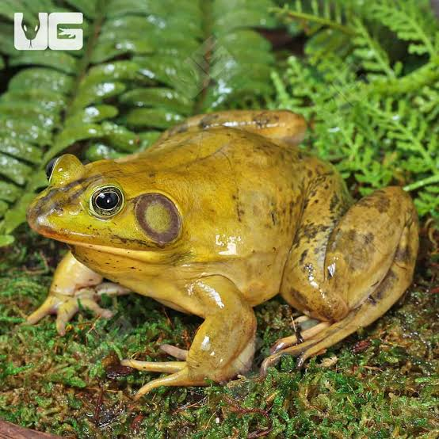

# BioLocLite

BioLocLite es una aplicación que permite
**identificar especies de flora y fauna local utilizandointeligencia artificial**, y notificar aquellas consideradas invasoras o peligrosas.

## Características

+ Análisis de imágenes de especies
+ Clasificación en especies comunes, raras o invasoras
+ Notificación a las autoridades en caso de especies peligrosas
+ Interfaz en línea de comandos (CLI)

## Cómo usar

1. Ejecuta el programa principal:

   ```java app```

2. Introduce la ruta de una imagen para analizar:

    ```java imagenes/rana_bullfrog.jpg```

    La aplicación permitirá visualizar una imagen como esta:

    

3. Recibe una notificación según el tipo de especie detectada.

**Nota:** Asegúrate de tener las imágenes en la carpeta `imagenes` para realizar las pruebas.

## Requisitos

1. Java 17+
2. IntelliJ IDEA o cualquier otro IDE compatible
   1. [Descarga InteliJ IDEA](https://www.jetbrains.com/idea/download/)
   2. [Guía de instalación](https://www.jetbrains.com/help/idea/installation-guide.html)
3. JUnit 5 para ejetutar los tests

## Formato de salida

| **Tipo de especie** |                     **Mensaje generado**                         |
| :-----------------: | -----------------------------------------------------------------|
| Común               | "Especie sin interés especial."                                  |
| Rara                | "Especie rara. Registrar avitamiento."                           |
| Invasora            | "¡ALERTA! Especie invsora detectada. Avisar a las autoridades."  |

## Autor

Desarrollado por **Equipo BioLoc**, como parte del proyecto de asignatura *Entornos de Desarrollo.*

 :rocket: [Ver documentación completa](https://github.com/tu-proyecto/documentacion)


## Licencia

Este proyecto está bajo la Licencia MIT. Consulta el archivo `LICENSE` para más detalles.