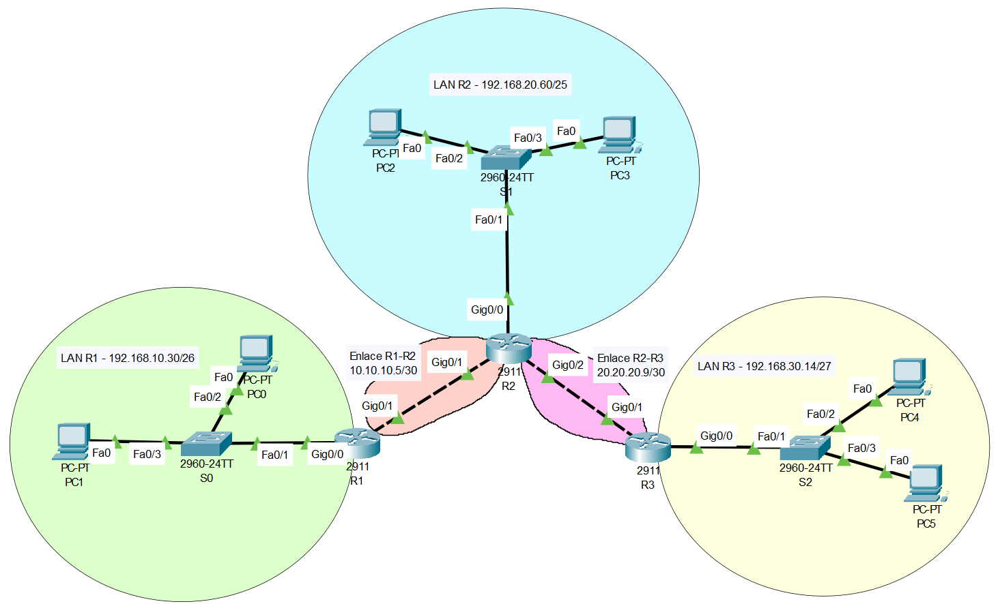

# 🧪 Examen práctico de redes
**Herramienta: Cisco Packet Tracer**  
**Valor total: 5 puntos**

---

## 🌐 Topología lógica


---

## 🔧 APARTADO 1 – Cálculo de subredes IPv4  
**Puntuación: 1,0 punto**

### Enunciado:  
A partir de las siguientes IPs y máscaras en formato CIDR, debes calcular para cada red:

- Dirección de red  
- Dirección de broadcast  
- Rango de direcciones IP válidas  

### Redes a calcular (con CIDR):

| Red | IP facilitada | Máscara (CIDR) |
|------|----------------|----------------|
| Enlace R1–R2 | 10.10.10.5 | /30 |
| Enlace R2–R3 | 20.20.20.9 | /30 |
| LAN R1 | 192.168.10.30 | /26 |
| LAN R2 (VLAN 10) | 192.168.20.60 | /25 |
| LAN R3 | 192.168.30.14 | /27 |
| VLAN 20 (*Para apartado 4*) | 192.168.25.5 | /27 |

### Evidencias a entregar:
- Documento con los **6 cálculos completos** (red, broadcast, rango).
- Captura o PDF con los resultados.

---

## 🔧 APARTADO 2 – Configuración de direcciones IP  
**Puntuación: 1,0 punto**

### Enunciado:  
Configura las direcciones IP en las interfaces de los routers y en los PCs. Escoge las que quieras dentro del rango utilizables de cada red.
Si no pudiste resolver el apartado anterior, utiliza estas **direcciones IP alternativas distintas**.

### IPs alternativas:

#### LAN R1 (Switch S0):
- R1 Gi0/0 → **10.1.1.1 255.255.255.0**  
- PC0 → **10.1.1.2 255.255.255.0**  
- PC1 → **10.1.1.3 255.255.255.0**  

#### LAN R2 (Switch S1 – VLAN 10):
- R2 Gi0/0 → **10.2.1.1 255.255.255.0**  
- PC1 → **10.2.1.2 255.255.255.0**  
- PC2 → **10.2.1.3 255.255.255.0**  

#### LAN R3 (Switch S2):
- R3 Gi0/0 → **10.3.1.1 255.255.255.0**  
- PC1 → **10.3.1.2 255.255.255.0**  
- PC2 → **10.3.1.3 255.255.255.0**  

#### Enlaces entre routers:
- R1 Gi0/1 → **172.16.1.1 255.255.255.0**  
- R2 Gi0/1 → **172.16.1.2 255.255.255.0**  
- R2 Gi0/2 → **172.16.2.1 255.255.255.0**  
- R3 Gi0/1 → **172.16.2.2 255.255.255.0**  

### Evidencias a entregar:
- Salida de `show ip interface brief` en cada router.  
- Capturas de configuración IP de los PCs.  
- Archivo `.pkt` funcionando.

---

## 🔧 APARTADO 3 – Enrutamiento estático  
**Puntuación: 2,0 puntos**

### Enunciado:  
Configura las rutas estáticas necesarias en los tres routers para permitir la **comunicación entre todas las redes** (LANs y VLANs).

### Comando:

**Pseudocódigo:**
```
ip route <red_destino> <máscara> <IP del siguiente salto>
```

**Ejemplo:**
```
ip route 10.3.1.0 255.255.255.0 172.16.2.2
```

### Evidencias a entregar:
- Captura de `show ip route` en cada router.  
- Al menos 3 capturas de pings entre PCs de diferentes redes.

---

## 🔧 APARTADO 4 – VLANs (segmentación sin router-on-a-stick)  
**Puntuación: 1,0 punto**

### Enunciado:  
Configura **VLAN 10** (Switch S0) y **VLAN 20** (Switch S0). La VLAN 10 se utilizará para la red ya existente (LAN R1); mientras que la VLAN 20 utilizará la red indicada en el apartado 1. Cada una debe conectarse a una **interfaz física distinta del router R1**. 
- R1 usará:
  - Gi0/0 para VLAN 10
  - Gi0/2 para VLAN 20


Si no pudiste resolver el apartado 1, utiliza (a mayores de las ya proporcionadas) estas **direcciones IP alternativas para la VLAN 20**.

#### VLAN 20 (Switch S0):
- R1 Gi0/2 → **10.1.2.1 255.255.255.0**  
- PC6 → **10.1.2.2 255.255.255.0**  
- PC7 → **10.1.2.3 255.255.255.0**  


### Pasos:
1. Crea las VLANs en el switch.  
2. Asigna puertos: mitad inferior a la VLAN 10, mitad superior a la VLAN 20.  
3. Conecta los PCs y routers según la VLAN que les corresponda.
4. Comprueba conectividad entre un PC de VLAN 10 y uno de VLAN 20.

### Comandos útiles:

**Crear VLAN:**
```
vlan 20
name NUEVA_RED
```

**Asignar puerto a VLAN:**
```
interface fa0/3
switchport mode access
switchport access vlan 20
```

### Evidencias a entregar:
- Salida de `show vlan brief` en cada switch.  
- Captura de ping entre un PC de VLAN 10 y uno de VLAN 20.
- Respuesta a la siguiente pregunta: ¿Con esta configuración tienen conectividad los PCs de diferentes VLANs?, ¿por qué?
- Archivo `.pkt` con VLANs correctamente configuradas.

---

